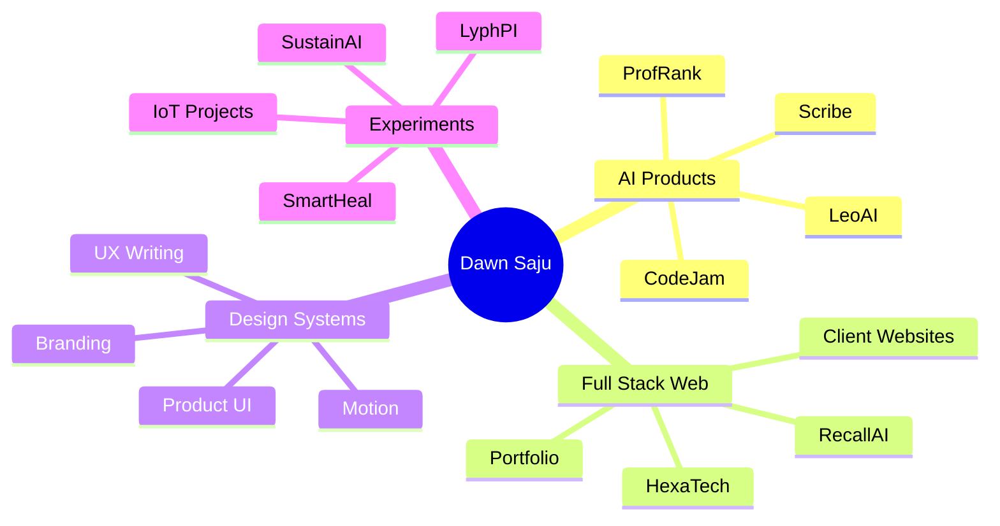
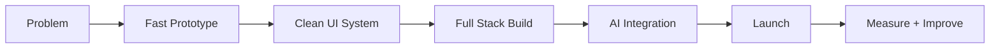
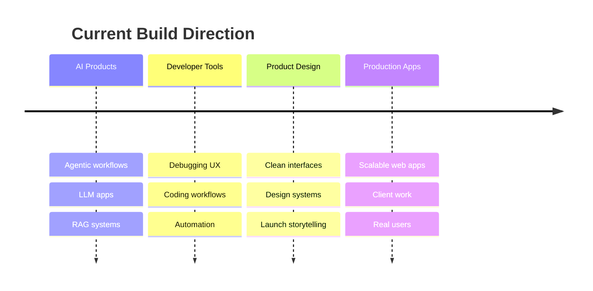

# Dawn Saju

**AI Developer • Full Stack Builder • Product Designer**

I've built multiple 0 to 1 AI platforms, integrated LLMs like Gemini and Claude, competed in national hackathons, and shipped Full Stack applications.

Currently building at the intersection of **AI, full-stack engineering, and clean product design**.

  
  
  

---

## Now

- Computer Science student based in Dubai, UAE
- Building AI products, developer tools, and SaaS-style web apps
- Focused on Next.js, TypeScript, Python, LLM apps, and polished UX
- Interested in agentic workflows, voice AI, and production-ready AI systems

---

## Selected achievements

<table>
  <tr>
    <td><b>2026 AI Hackathon Winner</b></td>
    <td>1st place among 1,900+ participants worldwide with CodeJam</td>
  </tr>
  <tr>
    <td><b>Hack Club Neighborhood</b></td>
    <td>Invited to a 3-month in-person builder program in San Francisco</td>
  </tr>
  <tr>
    <td><b>Apple iOS Design Challenge</b></td>
    <td>Recognized for design excellence through SustainAI</td>
  </tr>
  <tr>
    <td><b>Founder</b></td>
    <td>Building products under trigen across AI, SaaS, education, and developer tools</td>
  </tr>
</table>

---

## About me

I'm a Computer Science student based in Dubai, UAE, building at the intersection of **AI, full stack engineering, and product design**.

I care about shipping useful products with clean UX, strong technical foundations, and real-world impact. My work spans AI agents, developer tools, SaaS platforms, learning systems, mobile apps, client websites, and hackathon projects.

Currently focused on:

- Building AI-powered web products with **Next.js, TypeScript, Python, and modern AI APIs**
- Designing polished, minimal interfaces with strong UX systems
- Creating tools that help people learn, build, debug, and move faster
- Exploring agentic workflows, voice AI, and production-ready AI applications

---

## Featured work

<table>
  <tr>
    <td width="50%">
      <h3>CodeJam</h3>
      

        Real-time AI debugging esports platform with Ghost Mode, Boss Battles, and competitive coding workflows.
      

      

        <b>Winner — 2026 AI Hackathon by ANORA Labs</b> 
        1st place among 1,900+ participants worldwide.
      

      

        
      

    </td>
    <td width="50%">
      <h3>Scribe</h3>
      

        AI vocabulary learning platform and browser extension that turns Netflix and YouTube into interactive language-learning experiences.
      

      

        Built over 100+ hours and invited to a 3-month in-person builder program in San Francisco.
      

      

        
      

    </td>
  </tr>
  <tr>
    <td width="50%">
      <h3>SustainAI</h3>
      

        Sustainability platform with waste classification, carbon tracking, EcoXP, and mobile/web support.
      

      

        Recognized for design excellence by Apple in the 2024 iOS Design Challenge.
      

      

        
      

    </td>
    <td width="50%">
      <h3>HexaTech</h3>
      

        Redesigned and migrated a Dubai-based technology company website from a WordPress single-page site into a scalable multi-page Next.js website.
      

      

        Built with server-side data fetching, custom CMS workflows, SEO, performance, and responsive UI.
      

      

        
      

    </td>
  </tr>
</table>

---

## Impact snapshot

<table>
  <tr>
    <td align="center" width="25%">
      <h3>1,900+</h3>
      
AI hackathon participants competed worldwide

    </td>
    <td align="center" width="25%">
      <h3>100+ hrs</h3>
      
Spent building Scribe as an open-source learning product

    </td>
    <td align="center" width="25%">
      <h3>$20K+</h3>
      
Approx. prize value from CodeJam hackathon awards

    </td>
    <td align="center" width="25%">
      <h3>3 months</h3>
      
Invited to an in-person builder program in San Francisco

    </td>
  </tr>
</table>

---

## Product map

---

## How I build

---

## Tech stack

  

<table>
  <tr>
    <td><b>Frontend</b></td>
    <td>Next.js, React, TypeScript, JavaScript, Tailwind CSS, Shadcn UI, Framer Motion</td>
  </tr>
  <tr>
    <td><b>Backend</b></td>
    <td>Node.js, Python, Flask, FastAPI, Firebase, Supabase, REST APIs</td>
  </tr>
  <tr>
    <td><b>AI / ML</b></td>
    <td>OpenAI APIs, LLM apps, RAG workflows, TensorFlow, PyTorch, scikit-learn, Pandas, NumPy</td>
  </tr>
  <tr>
    <td><b>Design</b></td>
    <td>Figma, UI/UX systems, branding, motion, product storytelling</td>
  </tr>
  <tr>
    <td><b>Tools</b></td>
    <td>Git, GitHub, Vercel, Netlify, Firebase Hosting, Render, Docker basics</td>
  </tr>
</table>

---

## Analytics

---

## Journey

  

---

## Highlights

- Winner — **2026 AI Hackathon by ANORA Labs**
- Built **Scribe**, an AI vocabulary learning platform for Netflix and YouTube
- Invited to a **3-month in-person builder program in San Francisco**
- Recognized by **Apple** for design excellence in the 2024 iOS Design Challenge
- Founder of **trigen**
- Building products across AI, SaaS, education, sustainability, and developer tools

---

## Current direction

I like taking ideas from messy notes to polished, usable products fast.

